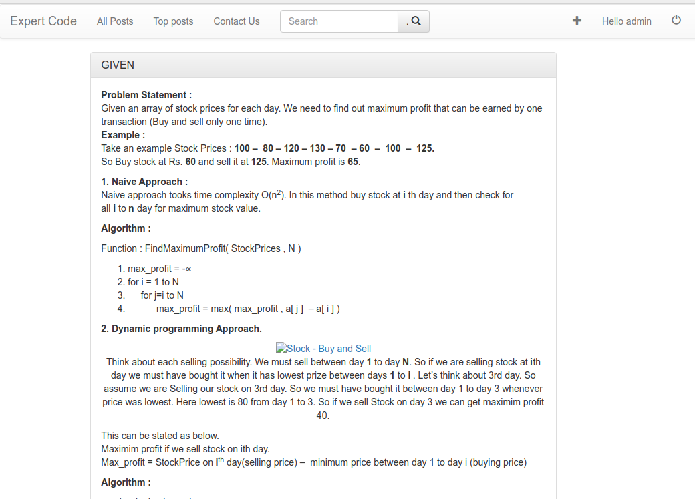
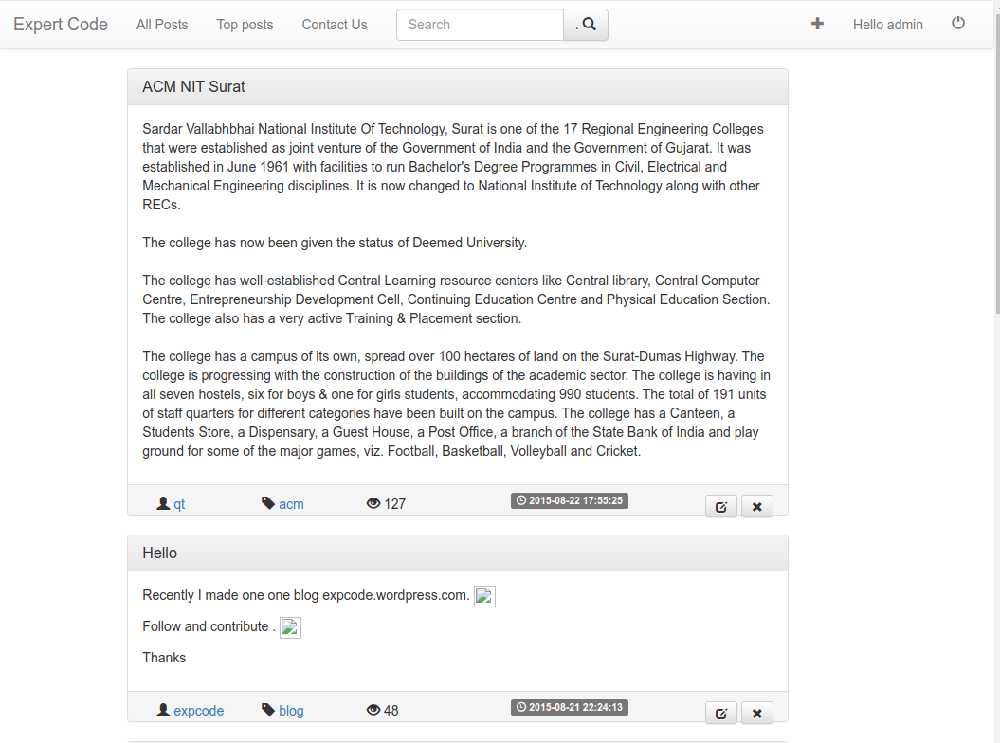
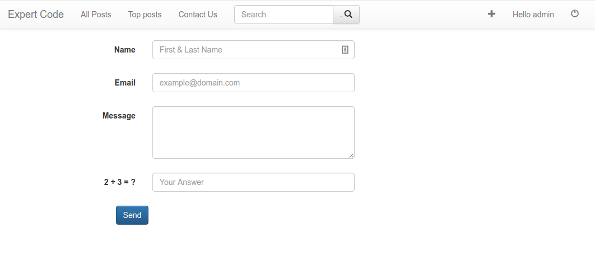
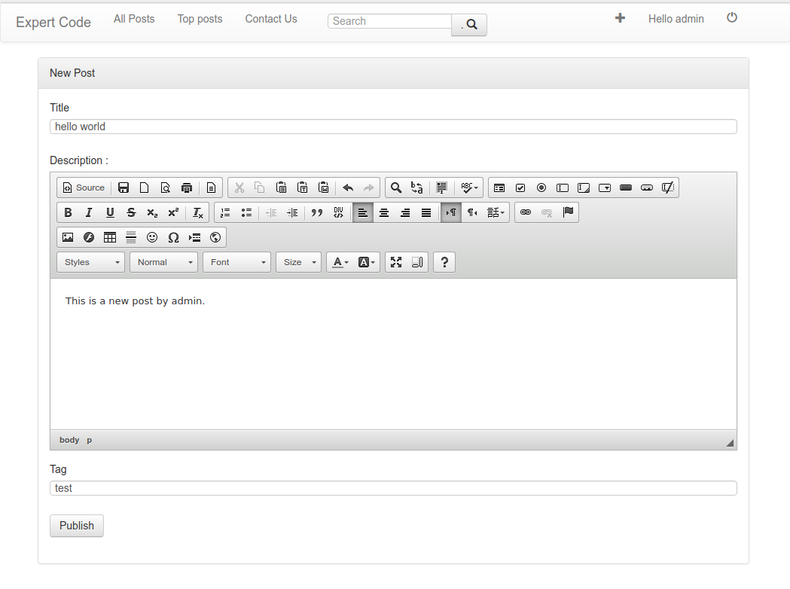
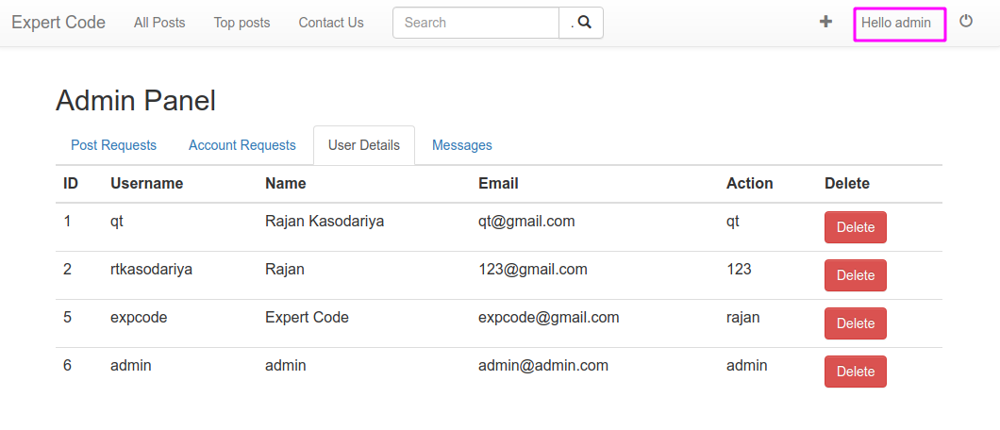

Blog
---
A simple web application using PHP and mysql.   
Source code is downloaded from site: [EASY BLOG SITE IN PHP WITH SOURCE CODE](https://download.code-projects.org/details/07fc5d88-edae-45a1-b96e-43da086d9826).  

# Setup

1. Setup a mysql database (recommend to use docker)
2. Execute sql to import db:  
```bash
    mysql -u root --protocol=tcp -padminpass < blog.sql
```
3. Setup [php environment](https://zhuanlan.zhihu.com/p/258606230) and mysqli tool

# Blog Introduction

## DB Tables

- comments(postID, commentID, commentDesc, commentAuthor, commentTime)
- messages(id, name, email, message, time)
- posts (postID, postTitle, postDesc, postTime, postTag, postAuthor)
- posts_buffer (postID, postTitle, postDesc, postTime, postTag, postAuthor)
- users (id, username, firstname, password, emailid, createdon, usertype)
- users_buffer (id, username, firstname, password, emailid, createdon, usertype)
- user_post (postAuthor, postID, postLikes, postDisLikes, postComments, postViews

## System screenshots


1. Post Lists


2. Top Posts


3. Contact Us


4. Add a new post


5. Admin Panel: when user posts new post, admin needs to approve it and then it can be displayed in post list.  


